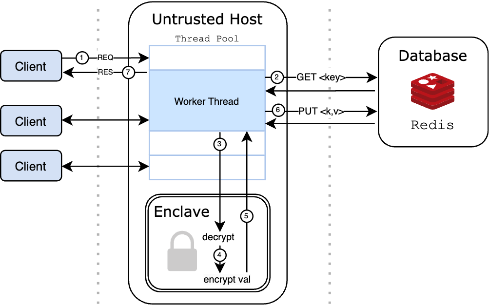

# ORTOA-TEE

ORTOA - a family of One Round Trip Oblivious Access protocols that reads or writes data stored on remote storage *in one round without revealing the type of access*.

The ORTOA-TEE project implements this access protocol leveraging the cryptographic guarantees of trusted execution environments (hardware enclaves) and benchmarks the performance.

## Background
This section proposes an alternate one round trip solution to hide the type of access using trusted execution environments (TEEs) such as Intel SGX. Main attributes of TEEs are as follows: 
- Secure areas within a main processor that protect the code and data loaded inside it with respect to confidentiality and integrity
- Provide isolation for code and data from the operating system using CPU hardware-level isolation and memory encryption

If a cloud vendor can provide hardware enclaves (i.e., TEEs), an application can deploy its entire system on the cloud, which enables the data and the trusted component to reside together, significantly reducing the communication latency compared to a trusted proxy-based system.

## Design & Implementation
The ORTOA-TEE data flow is as follows:



1. Client sends a request to an untrusted host with the following packet:
   1. Operation type *C* (GET or PUT)
   2. Key *k* (an unencrypted integer)
   3. Value *v<sub>new</sub>* (an encrypted string) (for GET requests, the value is randomly generated to maintain uniformity between operation types)
2. Untrusted host retrieves the value, *v<sub>old</sub>*, that corresponds to key *k* from the database (current implementation uses Redis)
3. Untrusted host sends *C*, *v<sub>old</sub>*, *v<sub>new</sub>* to enclave
4. The enclave conducts a decryption and encryption based on the following rules:
   - If operation *C* is GET: decrypt and re-encrypt *v<sub>old</sub>*
   - If operation *C* is PUT: decrypt and re-encrypt *v<sub>new</sub>*
5. Return the encrypted value *v<sub>enclave</sub>* to untrusted host
6. Untrusted host puts the value *v<sub>enclave</sub>* into database with key *k*
7. Untrusted host returns the value *v<sub>enclave</sub>* to client

## Scripts & Utilities

We provide a bash script library `srcipts/ortoa-lib.sh` that houses a collection of scripts and utilities to manage the `ORTOA` environment. It can be sourced as follows:

```bash
ORTOA/ $ source scripts/ortoa-lib.sh
```

## Building the codebase

Details about the build can be found at [TODO](todo). The easiest way to build the C++ projects is to run the `ortoa-cbi` script.

```bash
ORTOA/ $ ortoa-cbi  # requires sourcing scripts & utilities
```

## Running ORTOA


### `ortoa-client-run`

Runs the `ORTOA-TEE` client

```bash
ORTOA/ $ ortoa-client-run -h
```

### `ortoa-host`

Runs the `ORTOA-TEE` host. Requires SGX hardware.

```bash
ORTOA/ $ ortoa-host -h
```

### `ortoa-simulate`

Runs the `ORTOA-TEE` host in simulation mode.

```bash
ORTOA/ $ ortoa-simulate -h
```

